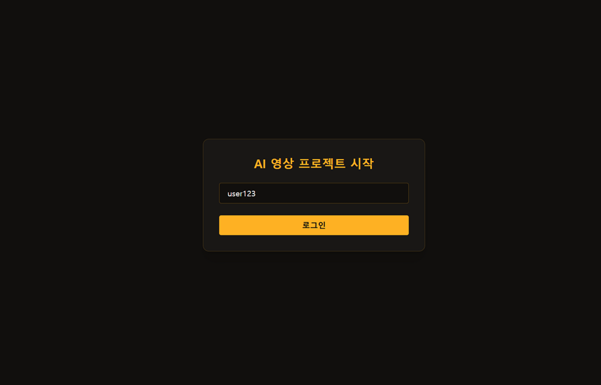
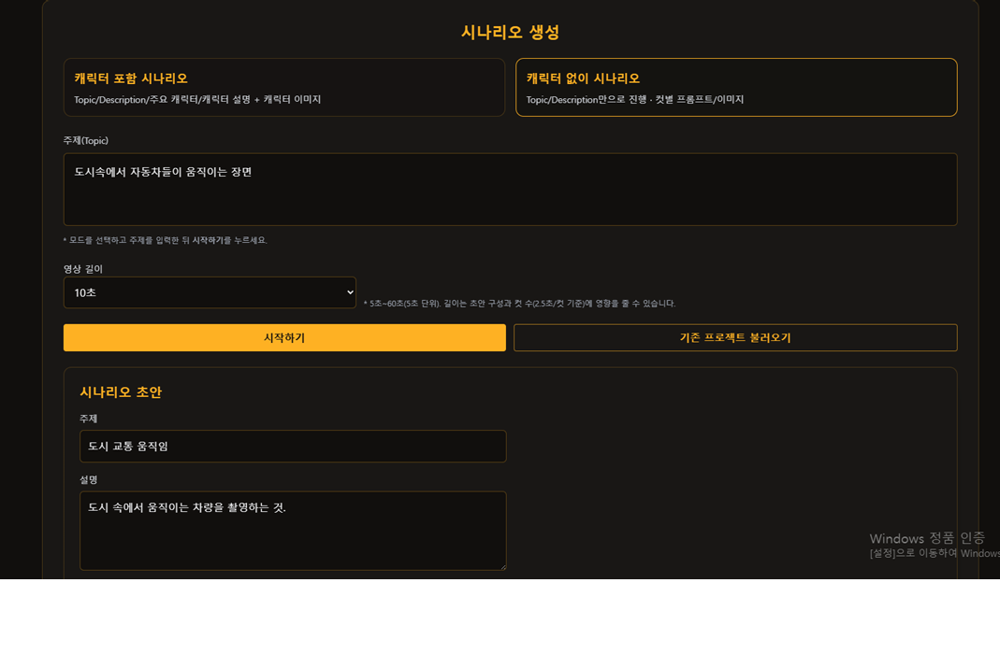
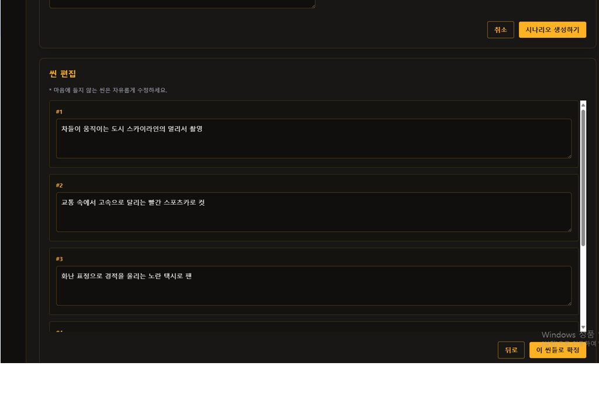
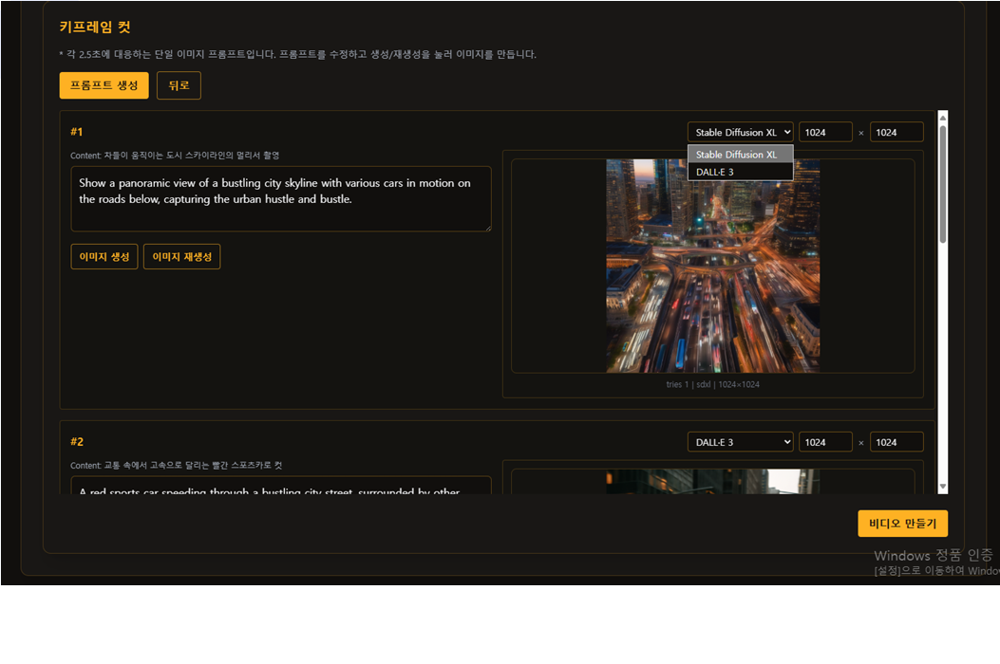
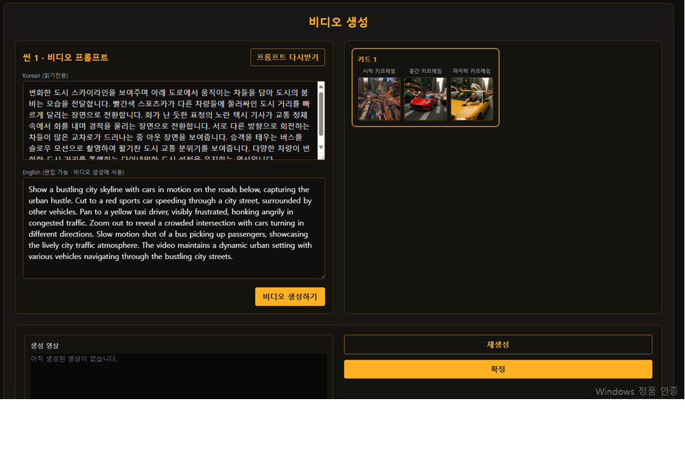

#  AI Video Generation Platform  
**오픈소스 생성형 AI 모델을 활용한 영상 제작 자동화 플랫폼 구현**  
*(Automated Video Production Platform Using Open-Source Generative AI Models)*

---
 

##  프로젝트 개요

이 프로젝트는 **Stable Diffusion XL**, **DALL·E 3**, **WAN2.1 VACE** 등의 생성형 AI 모델을 결합하여  
**텍스트 입력만으로 영상 제작이 가능한 자동화 시스템**을 구현한 웹 플랫폼입니다.  
사용자가 간단한 문장을 입력하면 ChatGPT 기반 LLM이 시나리오를 생성하고,  
LangChain 템플릿을 통해 **키프레임 및 영상용 프롬프트를 자동 생성**한 후  
이미지·영상 생성 모델을 호출하여 동영상을 생성합니다.  

>  목표: 비전문가도 AI 모델을 직접 다루지 않고, 텍스트만으로 자연스러운 영상 콘텐츠를 생성할 수 있는 자동화 플랫폼을 만드는 것

---
  
##  시스템 구조

사용자 입력 (텍스트) 
       ↓ 
시나리오 및 장면 요약 생성 (ChatGPT-4) 
       ↓ 
키프레임용 프롬프트 자동 생성 (LangChain 템플릿) 
       ↓ 
Stable Diffusion / DALL·E 3 → 키프레임 이미지 생성 
       ↓ 
WAN2.1 VACE → 5초 단위 영상 클립 생성 
       ↓ 
클립 연결 및 영상 출력 
  

## 주요 기능
**1. 시나리오 자동 생성**
   

사용자의 텍스트 입력을 LLM이 분석하여 주제, 설명, 인물, 배경, 장면 내용을 자동 구성

예시: "한 소년이 바닷가에서 해질녘에 걷는 장면" → 시나리오 및 장면별 내용 자동 생성

**2. 키프레임 프롬프트 자동 생성**
   

LangChain 기반 템플릿을 통해 2.5초 단위 영상 비트(beat)에 대응하는 이미지 프롬프트 자동 생성

영어 기반 프롬프트로 생성하여 번역 손실 최소화

**3. 영상 프롬프트 자동 생성**

시작·중간·종료 프레임을 기반으로 LangChain 템플릿(gen_video_prompt)에서 자연스러운 모션이 있는 영상용 프롬프트 생성

WAN2.1 VACE에 전달되어 5초 단위 영상 클립 생성

**4. 웹 기반 실시간 영상 생성**

FastAPI + WebSocket을 통해 백엔드 연산 상태를 실시간으로 전송

프론트(Vue.js)에서 영상 생성 진행률(%) 및 결과 이미지 확인 가능

**5. 프로젝트 및 데이터 저장**
   

SQLAlchemy ORM 기반 SQLite 저장 구조

사용자별 프로젝트 ID, 시나리오, 이미지/영상 경로 관리

  
## 시연영상 : https://www.youtube.com/watch?v=t62Wdzw9qq4

로그인 페이지

시나리오 생성 페이지 1

시나리오 생성 페이지 2

키프레임 생성 페이지

비디오 생성 페이지

 

**기술스택**
| 분류 | 기술 |
|------|------|
|Infra / Dev|Python 3.10+, Node.js 18+, Git|
| 프론트엔드 | Vue.js, HTML, CSS, JavaScript |
| 백엔드 | FastAPI, WebSocket |
| AI Models | diffusers, WAN2.1 VACE, DALL·E 3 |
| DB | SQLAlchemy (SQLite) |

